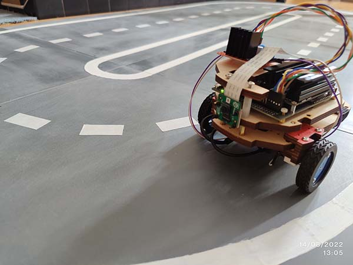

# Girls into Coding Jetson Nano Self Driving Car

A workshop where participants train a robotic car to drive around a road.

Uses Python and Jupyter Notebooks combined with Anaconda and PyTorch for model training.

### jetsonnano
Code to go on Jetson Nano

### training
Code to go on laptop for building the model

### designs
2D and 3D designs for component parts

Please go to [www.thinkcreatelearn.co.uk](www.thinkcreatelearn.co.uk) for more details.